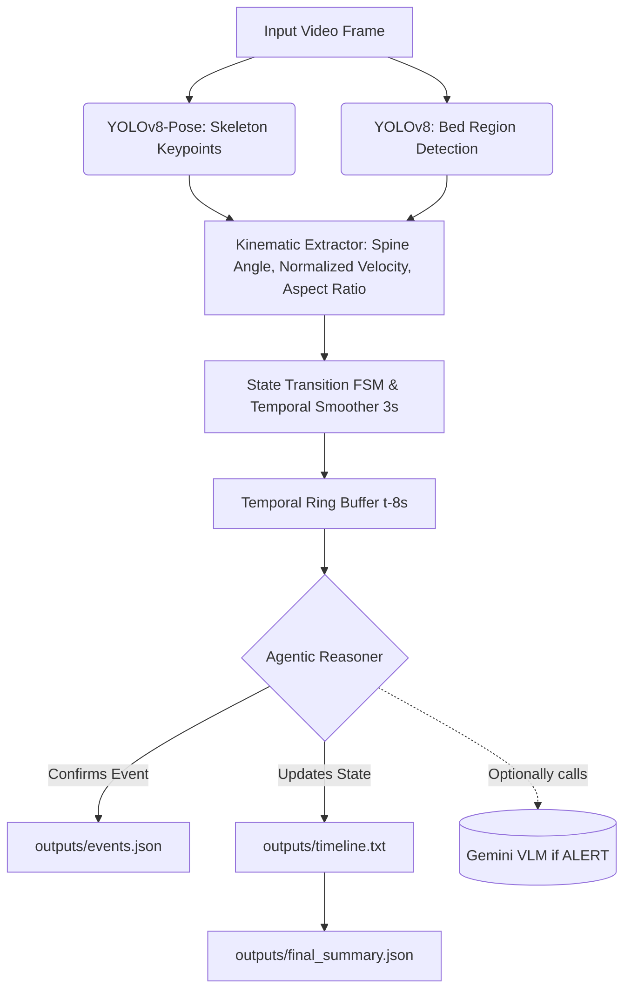

# ElderWatch-AI - Patient Monitoring System

An Agentic AI + Computer Vision system designed to analyze continuous indoor videos of elderly persons to track temporal activities and detect bed-related events.

## Features
- **Activity State Recognition:** Tracks states (`LYING_IN_BED`, `SITTING`, `STANDING`, `WALKING`, `OUT_OF_BED`) using Kinematics + Temporal Ring Buffer.
- **Event Detection:** Robust detection of `BED_EXIT` and `RETURN_TO_BED`.
- **JSON Deliverables Generation:** Automatically produces `events.json`, `final_summary.json`, and `timeline.txt`.
- **Agentic Logic (Contextual Alerts):** Issues `NORMAL`, `MONITOR`, and `ALERT` decisions contextually by observing past kinematic windows (8 seconds history).
- **VLM Support:** Optional Gemini fallback mechanism.

## Architecture Diagram


## Instructions to Run

### Setup Environment
```bash
python -m venv .venv
.\.venv\Scripts\activate
pip install -r requirements.txt

# (Optional) For VLM Agent mode, create your .env
cp .env.example .env
```

### Full Evaluation (Batch Mode)
Evaluates your test videos against ground truth and generates all reports.
1. Place test videos inside `test_videos/`
2. Update `tests/ground_truth.json` (or use `tests/auto_annotate.py` to auto-label).
3. Run:
```bash
python run_tests.py
```

### UI Testing Mode
To visually test individual videos using a frontend:
```bash
python app.py
```

## Contextual Alert Rules
The Agent outputs one of three decisions within `outputs/events.json`:
- **NORMAL:** Person is lying down on the bed, or returns to bed completely.
- **MONITOR:** Person triggers a `BED_EXIT` event or sits on the edge of the bed. Monitoring is required as falls frequently happen during transitions.
- **ALERT:** Person is lying horizontally *outside* of the detected bed region (Possible Floor Fall) or an unexplained prolonged absence.

## Failure Case Examples (Limitations)
1. **Extreme Disocclusion (Body Cropped):** If the person walks extremely close to the camera causing 90% of their body to be cropped out, the Object Detector loses the hip/shoulder keypoints entirely. We implemented an Aspect-Ratio compensation for bottom-level cropping, but complete cutoffs will crash tracking into `UNKNOWN`.
2. **Dense Multimodal Interference:** If multiple caregivers obscure the camera view entirely for significant portions (>4 seconds), the spine angle interpolation breaks.
3. **Imperfect Bed Bounds due to Blanket Colors:** Sometimes YOLOv8 bounding box for "Bed" drifts if white blankets blend seamlessly into white hospital floors. This can occasionally misreport `SITTING_ON_BED` as `SITTING_OUTSIDE_BED`.

## Deliverables Manifest
After running `python run_tests.py` or processing a video:
- `outputs/timeline.txt`: Action timeline
- `outputs/events.json`: Bed-exit/return formatted events
- `outputs/final_summary.json`: Activity duration summary
- `evaluation_results/FULL_EVALUATION_REPORT.txt`: Model accuracy, F1, and duration errors
- `outputs/agent_analysis.log`: Descriptive agentic reasoning paths
